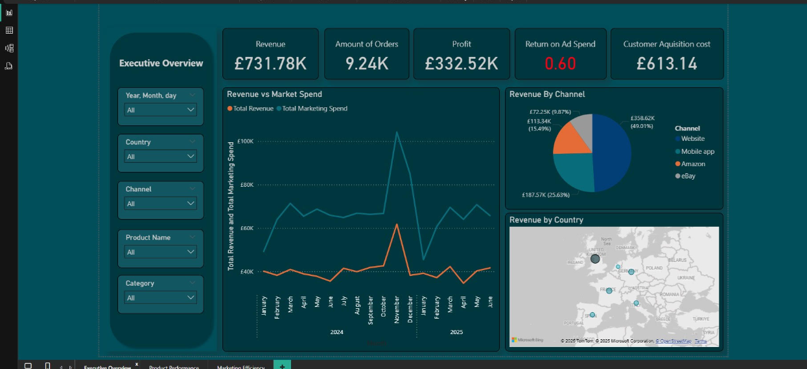
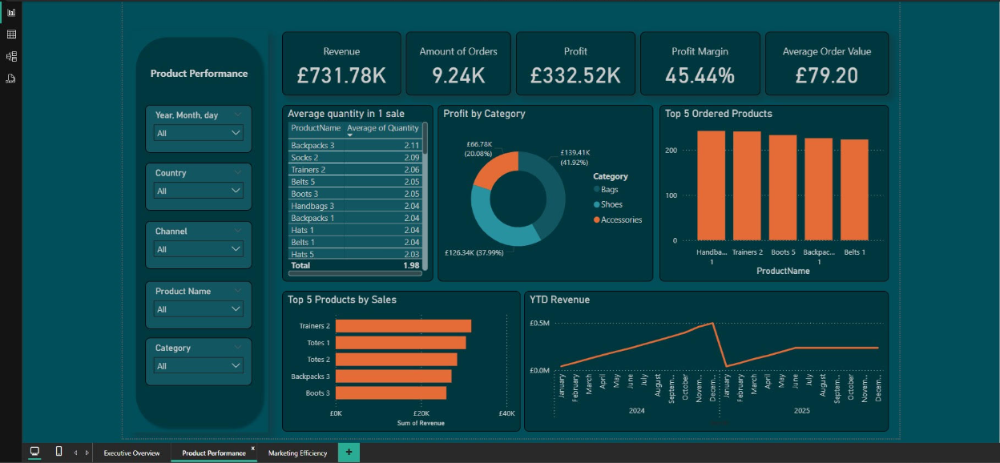
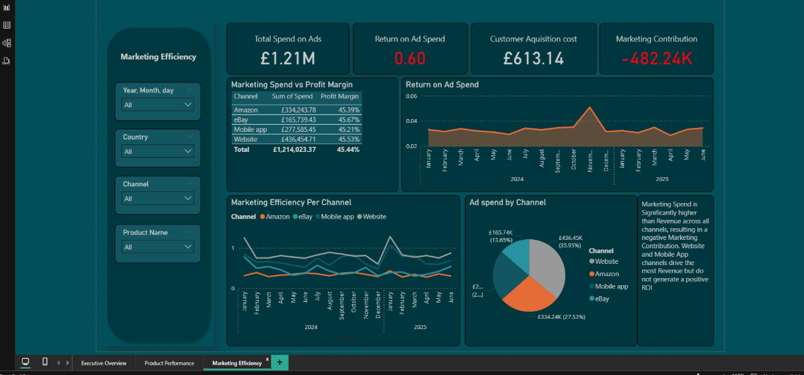

# E-commerce Marketing and Product Performance Dashboard

## Overview

This Power BI dashboard provides comprehensive insights into an e-commerce business's marketing performance, customer acquisition costs, and product sales efficiency. The report is structured across **three main pages**:

---

## 1. Executive Overview

Key business metrics and high-level trends:

- **Revenue**: Total sales revenue generated.
- **Amount of Orders**: Total number of customer orders.
- **Profit**: Total profit after subtracting costs.
- **Return on Ad Spend (ROAS)**: Marketing return efficiency (Revenue / Marketing Spend).
- **Customer Acquisition Cost (CAC)**: Average spend to acquire one new customer.
- **Revenue vs Market Spend**: Line chart comparing total revenue vs ad spend over time.
- **Revenue by Channel**: Pie chart breakdown (e.g., Website, Mobile App, eBay, Amazon).
- **Revenue by Country**: Map visual showing geographic sales performance.

---

## 2. Product Performance

Detailed product-level analysis:

- **Average Quantity per Sale**: Shows average units sold per order by product.
- **Profit by Category**: Pie chart showing contribution by category (e.g., Shoes, Bags).
- **Top 5 Ordered Products**: Column chart based on order count.
- **Top 5 Products by Sales**: Bar chart based on total revenue.
- **YTD Revenue**: Year-to-date trend of total revenue.

---

## 3. Marketing Efficiency

Focus on ad spend, profitability, and ROI by channel:

- **Total Spend on Ads**: Sum of marketing expenditure.
- **Return on Ad Spend (ROAS)**: Revenue generated per £1 spent.
- **Customer Acquisition Cost (CAC)**: Spend per unique customer.
- **Marketing Contribution**: Revenue – Marketing Spend.
- **Marketing Spend vs Profit Margin**: Table comparing profitability by channel.
- **Marketing Efficiency Per Channel**: Line chart trend over time.
- **Ad Spend by Channel**: Pie chart showing distribution of marketing budget.
- **Insight Box**: Strategic insight on marketing performance.

---

## Filters Included

- **Date (Year, Month, Day)**
- **Country**
- **Channel**
- **Product Name**
- **Category**

These filters apply across pages for seamless slicing and user exploration.

---

## Tools Used

- **Power BI Desktop**
- **DAX (Data Analysis Expressions)**
- **Power Query**
- **Data Modelling with Relationships**

---
SQL Analysis

As part of the project, raw datasets were explored and cleaned using SQL. Key business questions were answered through custom-written SQL scripts before visualization in Power BI. Highlights include:

Top Products by Revenue and Orders

Revenue Trends (Monthly, MoM %, YTD)

Marketing Spend vs Revenue by Channel

Customer Acquisition Cost by Channel

Profit Margins by Product

Geographic Distribution of Orders

---
## Author

**Ashraf Sanni**  
Data Analyst | Power BI Developer  
[Upwork Profile](https://www.upwork.com/freelancers/~01cddd11baa57b2fef)
[LinkedIn Profile](www.linkedin.com/in/ashraf-tobi-sanni-14769521a)

Email: *(ashrafsanni09@gmail.com)*

---

## Notes

- Customer Acquisition Cost and ROAS are calculated dynamically using DAX.
- All pages are interactive and filter-aware.
- Visual consistency and colour palette are optimised for business storytelling.
- Dax queries can be seen here: [Dax Measures](https://github.com/atshuncho/E-commerce-Marketing-and-Product-Performance-Dashboard/blob/main/PowerBI/README.md)
